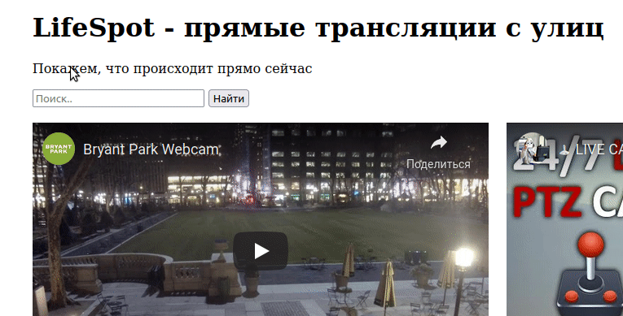

### 27.9 HTML/CSS на примере проекта LifeSpot

* Добавьте под слоганом текстовое поле для поиска видео на странице.
* Также сделайте так, чтобы ваше текстовое поле подсвечивалось, когда пользователь выбирает его для ввода.

