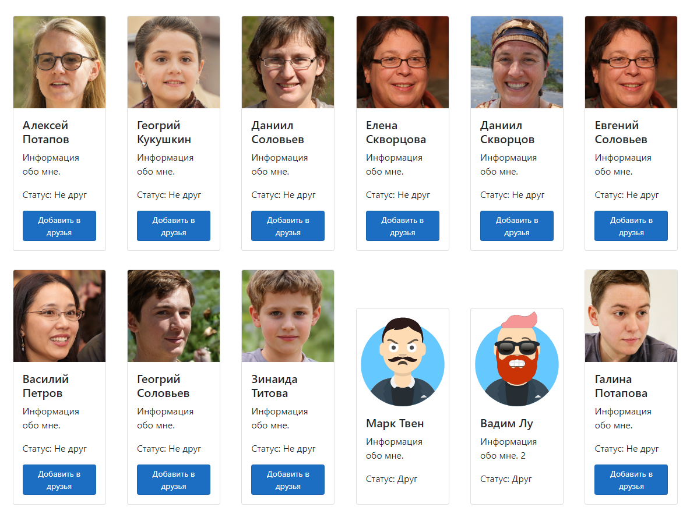
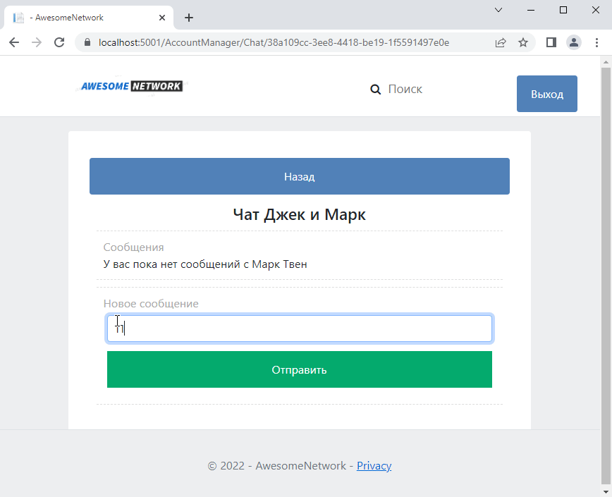

###  Модуль 35. Проект на ASP.NET Core. Социальная сеть

* В методе генерации пользователей _Generate()_ фотографии пользователей загружаются в локальной каталог.
В результате фотографии отображаются на странице быстрее, и многие пользователи имеют разные фото.
* На странице поиска найденные пользователи отображаются в виде карточек (Bootstrap, класс _Card_):
 

* При вводе в поле поиска пустой строки на странице отображаются все пользователи. 
У пользователей отображается статус "Друг"/"Не друг".

* Чат переделан с использованием технологии AJAX.

* Репозитории сделаны асинхронными